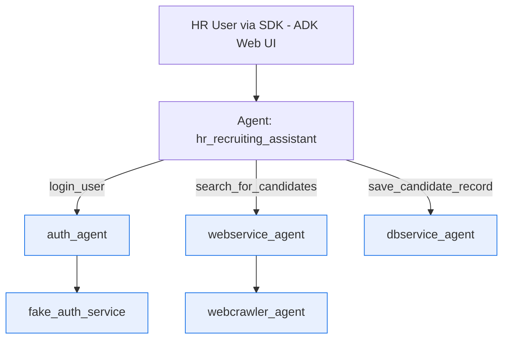

# Automating HR Recruitment with an AI Agent (Google ADK)

## 1. Introduction: The Challenge in HR Recruitment

Finding and managing candidates involves repetitive tasks: logging into systems, searching across platforms or databases based on specific criteria (job title, skills), and then saving promising candidates to a local system or database. This process can be time-consuming and prone to manual error.

Our goal is to automate this workflow using a smart AI assistant.

## 2. Solution: The HR Recruiting Assistant Agent

We have developed an AI agent, the "HR Recruiting Assistant," designed to streamline the initial stages of candidate sourcing. Given user credentials (username/password) and search criteria (job title, skills), the agent automatically performs the following workflow:

1. **Logs In:** Securely authenticates with the necessary HR system (using the `auth_agent`).
2. **Searches Candidates:** Queries the candidate sourcing platform (via the `webservice_agent`) using the specified title and skills.
3. **Saves Results:** Stores the details of all found candidates into a designated database (using the `dbservice_agent`).

This allows HR professionals to trigger the entire process with a single request and receive a summary of the results, significantly saving time and effort.

## 3. Technology Used: Google Agent Development Kit (ADK)

This assistant is built using the  **Google Agent Development Kit (ADK)** .

* **What is ADK?** ADK is an open-source Python toolkit provided by Google for building sophisticated AI agents. It allows developers to define an agent's behavior, its capabilities (called "Tools"), and how it orchestrates tasks using code. Find the code here: [google/adk-python GitHub Repository](https://github.com/google/adk-python) and documentation here: [ADK Documentation](https://google.github.io/adk-docs/).
* **Why ADK?**
  * **Leverages Powerful AI (LLMs):** ADK agents use Large Language Models (like Google's Gemini) as their core "brain." This allows them to understand instructions (like "log in, then search, then save") and intelligently decide which "Tool" (capability) to use next.
  * **Flexibility:** It's easier to modify or extend the agent's behavior by changing its instructions or adding new tools, rather than rewriting complex code logic.
  * **Code-First Approach:** Defining everything in Python makes the agent easy to test, version control, and integrate into other systems.
  * **Tool Integration:** ADK makes it straightforward to give the agent capabilities by connecting functions, APIs (like our platform services), or even other agents as "Tools."
  * **Google Cloud Integration:** It's designed to work seamlessly with Google Cloud services like Vertex AI for running the underlying AI models reliably.

## 4. How This Project Uses ADK

In our HR Recruiting Assistant, ADK orchestrates the entire workflow:

1. **Instructions:** We provide the ADK agent with clear instructions outlining the sequence: "Log in using Tool A, if successful, Search using Tool B, then for each result, Save using Tool C."
2. **Tools:** We defined specific ADK "Tools" that handle the communication (via secure JSON-RPC calls) with our existing platform services:
   * `login_user`: Calls the `auth_agent`.
   * `search_for_candidates`: Calls the `webservice_agent`.
   * `save_candidate_record`: Calls the `dbservice_agent`.
3. **Orchestration:** When the agent receives a request (e.g., username, password, title, skills), its internal LLM interprets the instructions and makes calls to these tools in the correct sequence, passing the necessary information (like the login token from the first step to the second).
4. **Result:** The agent provides a final summary of the operation, including how many candidates were found and saved.

## 5. Benefits and Next Steps

Using ADK allows us to build a more intelligent and potentially adaptable HR assistant compared to rigidly coded workflows. While the current workflow is linear, ADK provides the foundation to easily:

* Add more complex decision-making (e.g., only save candidates with > N years experience).
* Incorporate more tools (e.g., sending email summaries).
* Potentially interact using natural language in the future.

## Comparison: ADK vs. LangGraph Approach

**ADK Approach (HRRecruitingAssistant-ADK-demo):**

* **Pros:**
  * **Leverages LLM Reasoning:** The core logic relies on the LLM (Gemini) understanding the `AGENT_INSTRUCTIONS` and orchestrating the tool calls (`login`, `search`, `save`). This can potentially handle more complex instructions or variations in the future without changing the code structure, only the prompt.
  * **Simplified Code Flow:** The Python code primarily defines tools and the agent's entry point. The complex sequencing logic is delegated to the LLM based on the natural language instructions.
  * **Tool Abstraction:** ADK provides a clear `@tool` abstraction using Pydantic schemas, making tool definition clean and reusable.
  * **Potential for Natural Language Trigger:** While this example uses a structured API call, ADK is inherently well-suited for agents triggered by natural language queries.
  * **Ecosystem Integration:** Designed for seamless integration with Google Cloud services and Vertex AI tooling.
* **Cons:**
  * **Reliance on Prompt Engineering:** The success heavily depends on how well the `AGENT_INSTRUCTIONS` prompt is written. Ambiguity can lead to the LLM calling tools out of order, skipping steps, or hallucinating actions. Ensuring the exact sequence (Login -> Search -> Loop Save) requires careful prompting.
  * **Latency:** Each step requiring LLM reasoning (deciding which tool to call next) adds latency compared to direct function calls in LangGraph. For a simple, fixed workflow, this can be slower.
  * **Debugging LLM Behavior:** If the agent doesn't follow the instructions correctly, debugging *why* the LLM made a certain decision can be more challenging than tracing a deterministic graph.
  * **Cost:** Each LLM inference step incurs costs. A highly sequential task might result in multiple LLM calls.
  * **State Management:** While ADK supports context/state, managing dependencies like the `token` from login requires careful handling either within the prompt instructions (asking the LLM to remember and use it) or potentially more complex state management within the ADK framework (which might vary based on ADK evolution). The example above simplifies this, assuming the LLM handles it via prompt context.

**LangGraph Approach (Original HRRecruitingAssistant-demo):**

* **Pros:**
  * **Explicit Control & Determinism:** The `StateGraph` defines the exact sequence of operations (nodes and edges). Execution is predictable and follows the defined path.
  * **Lower Latency (Potentially):** Transitions between nodes are direct Python function calls, which can be significantly faster than LLM inference for simple sequences.
  * **Easier Debugging for Flow:** Tracing the execution path through the defined graph states is straightforward.
  * **Clear State Management:** State is explicitly defined (e.g., `HRAState` TypedDict) and passed between nodes. Managing the `token` is simple.
* **Cons:**
  * **Rigidity:** Changes to the workflow sequence require modifying the graph code (adding/removing nodes or edges). Less adaptable to dynamic changes based on intermediate results without adding complex conditional edges.
  * **Boilerplate Code:** Defining the state, nodes, and edges can involve more boilerplate code compared to defining tools and writing instructions for ADK.
  * **Less "Intelligent" Orchestration:** The flow is hardcoded; it doesn't inherently use LLM reasoning  *for the orchestration itself* , only potentially *within* individual nodes if designed that way.

**Why ADK *Might* Be Better (or When to Choose It):**

1. **Future Flexibility:** If you anticipate the HR workflow becoming more complex, involving conditional logic based on results (e.g., "if candidate seniority > 5 years, perform additional checks"), or incorporating natural language interaction, ADK's LLM-driven approach is more adaptable. Modifying the instructions might be easier than restructuring a graph.
2. **Complex Tool Selection:** If the agent had many more tools and needed to decide *which* search or save method to use based on subtle context, the LLM's reasoning is powerful.
3. **Leveraging Advanced LLM Capabilities:** For tasks requiring summarization, data extraction, or complex decision-making *during* the workflow orchestration, ADK shines.
4. **Google Cloud Native:** If you are heavily invested in the Google Cloud ecosystem, ADK offers tighter integration with Vertex AI monitoring, management, and other services.

**Conclusion for this Specific Project:**

For the *current, strictly defined* workflow (Login -> Search -> Save All), the LangGraph approach offers more predictable control, potentially lower latency, and arguably simpler debugging  *of the flow itself* . However, the ADK approach provides a foundation that is potentially more flexible for future enhancements and leverages powerful LLM orchestration capabilities, even if it might be slight overkill for this specific linear sequence. The ADK implementation relies heavily on crafting the correct prompt to ensure the LLM executes the steps reliably and in the correct order.
